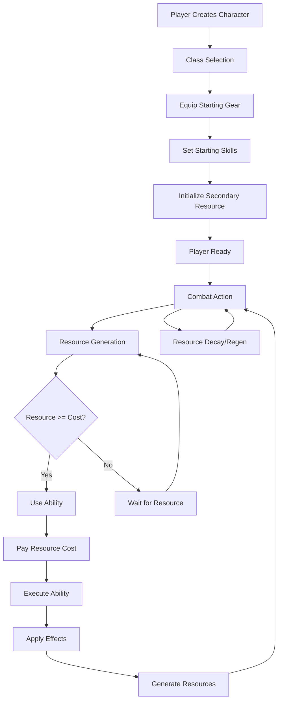

# Class System Flow Architecture

**System:** Vystia Character Classes  
**Components:** 25 classes, 15 secondary resources, ability system  
**Last Updated:** 2025-01-10

---

## Overview

The class system provides unique playstyles for each of 25 character classes through primary skills, secondary resources, and class-specific abilities. This document describes the complete flow from class selection through resource generation and ability usage.

---

## Flow Diagram



---

## Detailed Flow Steps

### 1. Class Selection

**Entry Point:** Player character creation or class change

**Process:**
1. Player selects class from 25 available classes
2. System validates selection
3. Class data loaded from `PlayerClassV2.cs` or specific class file

**Files:**
- `ServUO/Scripts/Custom/VystiaClasses/Classes/PlayerClassV2.cs`
- `ServUO/Scripts/Custom/VystiaClasses/Classes/[ClassName]Class.cs`

**Output:**
- Class type assigned to player
- Starting stats set (STR, DEX, INT)
- Primary skill identified

---

### 2. Starting Gear Equip

**Process:**
1. `EquipStartingGear()` called
2. Class-specific items created and equipped
3. Items include: weapon, armor, class focus item

**Files:**
- Each class file: `EquipStartingGear()` method
- `ServUO/Scripts/Custom/VystiaClasses/Items/ClassSpecialItems.cs`

**Example (Barbarian):**
```csharp
m.AddItem(new TwoHandedAxe() { Name = "Barbarian's Axe", Hue = ClassHue });
m.AddItem(new BoneChest() { Name = "Barbarian's Chest", Hue = ClassHue });
// ... more items
```

---

### 3. Starting Skills Set

**Process:**
1. `PrimarySkills` array defines required skills
2. `StartingSkillValues` array sets initial skill values
3. Skills reserved for class (cannot be reduced below starting values)

**Files:**
- Each class file: `PrimarySkills` and `StartingSkillValues` properties

**Example (Ice Mage):**
```csharp
PrimarySkills => new SkillName[] { SkillName.Cryomancy, SkillName.Magery, ... }
StartingSkillValues => new double[] { 100.0, 100.0, 80.0, 80.0 }
```

---

### 4. Secondary Resource Initialization

**Process:**
1. `VystiaResourceManager` attached to player
2. Secondary resource type determined from class
3. Resource instance created via factory
4. Resource initialized to 0 or starting value

**Files:**
- `ServUO/Scripts/Custom/VystiaClasses/Systems/VystiaResourceManager.cs`
- `ServUO/Scripts/Custom/VystiaClasses/Systems/SecondaryResource.cs`

**Resource Types:**
- Fury (Barbarian): 0-100
- Chi (Monk): 0-5
- SoulShards (Warlock): 0-5
- ChillStacks (Ice Mage): 0-5 per target
- ... (15 total types)

---

### 5. Resource Generation

**Trigger Events:**
- Combat actions (damage dealt, damage taken, block, kill)
- Ability usage
- Time-based (decay/regen per tick)

**Process:**
1. Combat hook called (e.g., `OnDamageDealt()`)
2. Resource manager checks resource type
3. Resource generation logic executed
4. Resource value updated
5. UI refreshed

**Files:**
- `ServUO/Scripts/Custom/VystiaClasses/Systems/VystiaResourceManager.cs`
- `ServUO/Scripts/Custom/VystiaClasses/Systems/SecondaryResource.cs`

**Example (Fury Generation):**
```csharp
// OnDamageDealt hook
if (resource is FuryResource fury)
{
    fury.Add(1 + (damage / 10)); // +1 base, +1 per 10 damage
}
```

**Resource Generation Rules:**
- **Fury (Barbarian):** +8 on hit, +15 on crit, +20 on kill, -5/sec out of combat
- **Chi (Monk):** +1 per combo finisher, -1 every 30 sec out of combat
- **SoulShards (Warlock):** 25% chance on crit, persist until spent
- **ChillStacks (Ice Mage):** +1 per ice spell hit (per target), -1 every 10 sec per target

---

### 6. Ability Usage

**Process:**
1. Player selects ability/spell
2. `AbilityExecutor.Execute()` called
3. Validation checks:
   - Resource cost available
   - Mana/stamina available
   - Cooldown not active
   - Requirements met (weapon, stealth, etc.)
4. If valid:
   - Pay costs (mana, stamina, resources)
   - Resolve targets
   - Apply effects
   - Generate resources
   - Trigger cooldown

**Files:**
- `ServUO/Scripts/Custom/VystiaClasses/Abilities/AbilityExecutor.cs`
- `ServUO/Scripts/Custom/VystiaClasses/Abilities/AbilityDefinition.cs`

**Validation Checks:**
```csharp
// From AbilityExecutor.cs
- CheckManaCost()
- CheckStaminaCost()
- CheckSecondaryResourceCosts()
- CheckCooldown()
- CheckRequirements() // weapon, stealth, stance, etc.
```

**Effect Application:**
```csharp
// Effects applied per target
- DirectDamage → VystiaDamageSystem
- DirectHeal → VystiaHealingCalculator
- ApplyBuff → VystiaBuffSystem
- ApplyCC → CrowdControlSystem
- ApplyStack → VystiaTargetTracker
```

---

### 7. Resource Decay/Regen

**Process:**
1. Timer ticks every second (or per game tick)
2. Resource manager checks each resource
3. Decay/regen logic applied
4. Resource value updated
5. UI refreshed

**Files:**
- `ServUO/Scripts/Custom/VystiaClasses/Systems/VystiaResourceManager.cs`
- `ServUO/Scripts/Custom/VystiaClasses/Systems/SecondaryResource.cs`

**Decay/Regen Rules:**
- **Fury:** -5/sec out of combat (reduced by Brutality skill)
- **Focus (Ranger):** +5/sec standing still, -10 on miss, -3/sec moving
- **Chi:** -1 every 30 sec out of combat
- **Steam (Artificer):** +5/sec near boiler, -cost per gadget use

---

## Class-Specific Mechanics

### Barbarian (Fury System)

**Flow:**
1. Enter combat → Start generating Fury
2. At 50+ Fury → Enraged state active (+damage)
3. Use Rage abilities (cost Fury)
4. At 80+ Fury → Berserker Rage available
5. Out of combat → Fury decays

**Key Abilities:**
- Savage Strike (20 Fury)
- War Cry (30 Fury)
- Berserker Rage (60 Fury)
- Deathblow (80 Fury, vs <25% HP)

### Ice Mage (ChillStack System)

**Flow:**
1. Cast ice spell → +1 ChillStack on target
2. ChillStacks accumulate per target (max 5)
3. At 4 stacks → Glacial Spike bonus damage
4. At 5 stacks → Shatter (auto-freeze) → reset stacks

**Key Mechanics:**
- Per-target tracking (via TargetTracker)
- Stack decay per target
- Freeze effect at 5 stacks

### Monk (Chi System)

**Flow:**
1. Use combo builder → Generate Chi
2. Chi accumulates (max 5)
3. Use finisher → Consume Chi for bonus damage
4. Out of combat → Chi decays slowly

**Key Abilities:**
- Combo builders (generate Chi)
- Finishers (consume Chi)

---

## Integration Points

### Class → Religion Integration

**Flow:**
1. Player has religion
2. Class-religion synergy checked
3. Resource bonuses applied:
   - Max resource increase
   - Generation rate increase
   - Cost reduction

**Files:**
- `ServUO/Scripts/Custom/VystiaClasses/Systems/VystiaSkillIntegration.cs`

**Example:**
- Monk + Cogsmith Creed → -10% Chi ability cost
- Barbarian + Frosthelm Faith → -15% Fury decay

### Class → Crafting Integration

**Flow:**
1. Player has class with crafting ability
2. Access crafting discipline
3. Use class-specific recipes
4. Apply class-religion crafting bonuses

**Files:**
- `ServUO/Scripts/Custom/VystiaClasses/Crafting/`

---

## Code References

### Key Files

1. **Class Base:**
   - `ServUO/Scripts/Custom/VystiaClasses/Classes/PlayerClassV2.cs`

2. **Resource System:**
   - `ServUO/Scripts/Custom/VystiaClasses/Systems/VystiaResourceManager.cs`
   - `ServUO/Scripts/Custom/VystiaClasses/Systems/SecondaryResource.cs`

3. **Ability System:**
   - `ServUO/Scripts/Custom/VystiaClasses/Abilities/AbilityExecutor.cs`
   - `ServUO/Scripts/Custom/VystiaClasses/Abilities/AbilityDefinition.cs`

4. **Combat Hooks:**
   - `ServUO/Scripts/Custom/VystiaClasses/Systems/VystiaDamageSystem.cs`
   - `ServUO/Scripts/Custom/VystiaClasses/Systems/TargetTracker.cs`

---

## Testing Scenarios

### Test 1: Resource Generation
1. Create Barbarian character
2. Enter combat
3. Deal damage
4. Verify Fury increases
5. Leave combat
6. Verify Fury decays

### Test 2: Ability Usage
1. Create Ice Mage character
2. Generate ChillStacks on target
3. Use ability that requires ChillStacks
4. Verify stacks consumed
5. Verify effect applied

### Test 3: Class-Religion Synergy
1. Create Monk character
2. Join Cogsmith Creed religion
3. Use Chi ability
4. Verify cost reduction applied

---

**Document Status:** Complete  
**Last Updated:** 2025-01-10
