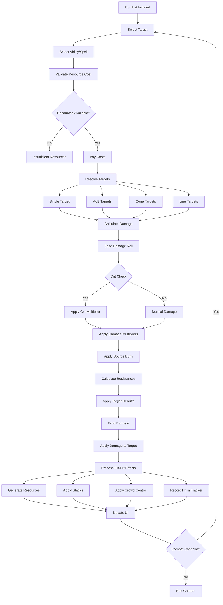

# Combat System Flow Architecture

**System:** Vystia Combat System  
**Components:** Damage calculation, resource generation, buff/debuff system, crowd control, PvP/PvE  
**Last Updated:** 2025-01-10

---

## Overview

The combat system provides comprehensive damage calculation, resource generation, buff/debuff management, and crowd control with full integration of class abilities, religion bonuses, and faction benefits. This document describes the complete flow from combat initiation through damage application.

---

## Flow Diagram



---

## Detailed Flow Steps

### 1. Combat Initiation

**Process:**
1. Player selects target
2. Player selects ability/spell
3. System validates ability availability
4. Combat state entered

**Combat State:**
- In-combat flag set
- Resource decay paused (for some resources)
- Combat tracking started

**Files:**
- `ServUO/Scripts/Custom/VystiaClasses/Systems/VystiaResourceManager.cs`
- `ServUO/Scripts/Custom/VystiaClasses/Abilities/AbilityExecutor.cs`

---

### 2. Resource Cost Validation

**Process:**
1. Ability defines resource costs:
   - Mana cost
   - Stamina cost
   - Health cost
   - Secondary resource costs
2. System checks player resources
3. If insufficient → Ability fails
4. If sufficient → Continue

**Resource Checks:**
```csharp
// From AbilityExecutor.cs
- CheckManaCost()
- CheckStaminaCost()
- CheckSecondaryResourceCosts() // Fury, Chi, SoulShards, etc.
```

**Files:**
- `ServUO/Scripts/Custom/VystiaClasses/Abilities/AbilityExecutor.cs`

---

### 3. Target Resolution

**Target Types:**
- **Self:** Just caster
- **SingleTarget:** One target
- **PointBlankAoE:** Radius around caster
- **TargetAoE:** Radius around target/ground location
- **Cone:** Cone in front of caster
- **Line:** Line from caster to target
- **ChainTarget:** Bounces with falloff

**Process:**
1. Target type determined from ability
2. Targets resolved based on type
3. Target list created
4. Effects applied to each target

**Files:**
- `ServUO/Scripts/Custom/VystiaClasses/Abilities/AbilityExecutor.cs`

---

### 4. Damage Calculation Pipeline

**Damage Pipeline Steps:**

1. **Base Damage Roll:**
   - Roll between MinDamage and MaxDamage
   - Base damage determined

2. **Crit Calculation:**
   - Crit chance checked
   - If crit → Apply crit multiplier
   - Crit damage = BaseDamage × CritMultiplier

3. **Damage Multipliers:**
   - Apply ability damage multiplier
   - Apply stance multiplier (if applicable)
   - Apply buff multipliers

4. **Flat Bonuses:**
   - Apply flat damage bonus
   - Apply weapon damage bonus

5. **Source Buffs:**
   - Apply buffs from caster
   - Damage increase buffs
   - Vulnerability debuffs on target

6. **Resistance Calculation:**
   - Calculate effective resists
   - Apply armor penetration
   - Apply resistance penetration
   - Final resistance value

7. **Target Debuffs:**
   - Apply shields (damage absorption)
   - Apply vulnerability debuffs
   - Apply damage reduction debuffs

8. **Final Damage:**
   - FinalDamage = (Damage × (1 - Resistance)) - Shields
   - Minimum 1 damage guaranteed

**Files:**
- `ServUO/Scripts/Custom/VystiaClasses/Systems/VystiaDamageSystem.cs`
- `ServUO/Scripts/Custom/VystiaClasses/Systems/VystiaBuffSystem.cs`

---

### 5. Resource Generation

**Trigger Events:**
- Damage dealt
- Damage taken
- Block
- Kill
- Crit
- Ability usage

**Resource Generation Rules:**

**Fury (Barbarian):**
- +8 on hit
- +15 on crit
- +20 on kill
- -5/sec out of combat

**Chi (Monk):**
- +1 per combo finisher
- -1 every 30 sec out of combat

**SoulShards (Warlock):**
- 25% chance on crit
- Persist until spent

**ChillStacks (Ice Mage):**
- +1 per ice spell hit (per target)
- -1 every 10 sec per target

**Files:**
- `ServUO/Scripts/Custom/VystiaClasses/Systems/VystiaResourceManager.cs`
- `ServUO/Scripts/Custom/VystiaClasses/Systems/SecondaryResource.cs`

---

### 6. On-Hit Effects

**Effect Types:**
- **ApplyChill:** Add chill stack
- **ApplyBleed:** Apply bleed DoT
- **ApplyBurn:** Apply burn DoT
- **ApplyCorruption:** Apply corruption DoT
- **ApplyPoison:** Apply poison DoT
- **ApplySlow:** Apply slow debuff
- **ApplyWeaken:** Apply stat debuff
- **LifeSteal:** Heal caster
- **ManaSteal:** Restore mana
- **StaminaDrain:** Drain target stamina
- **Knockback:** Push target back
- **Stun:** Apply stun CC

**Process:**
1. On-hit effects defined in ability
2. Effects applied after damage
3. Effects processed per target

**Files:**
- `ServUO/Scripts/Custom/VystiaClasses/Systems/VystiaDamageSystem.cs`
- `ServUO/Scripts/Custom/VystiaClasses/Systems/VystiaBuffSystem.cs`

---

### 7. Stack Application

**Stack Types:**
- Chill (Ice Mage)
- Combo Points (Rogue)
- Pursuit (Bounty Hunter)
- Curse (Witch)
- Mark (various classes)

**Process:**
1. Stack type determined
2. Stack added to target (via TargetTracker)
3. Stack threshold checked
4. If threshold met → Special effect triggered

**Stack Thresholds:**
- **Chill 5:** Frozen (root, can't move)
- **Combo 5:** Max stacks (finisher ready)
- **Pursuit 10:** Max stacks

**Files:**
- `ServUO/Scripts/Custom/VystiaClasses/Systems/TargetTracker.cs`

---

### 8. Crowd Control Application

**CC Types:**
- Stun, Freeze, Root, Silence, Fear, Sleep, Charm, Knockback, Knockdown, Slow, Blind, Disarm, Pacify, Confuse, Polymorph

**Diminishing Returns:**
- **1st CC:** 100% duration
- **2nd CC (within 15s):** 50% duration
- **3rd CC (within 15s):** 25% duration
- **4th CC+:** Immunity for 15s

**DR Categories:**
- Stun (Stun, Knockdown)
- Incapacitate (Fear, Sleep, Charm, Confuse)
- Root (Root, Freeze)
- Silence (Silence, Pacify, Disarm)
- None (Slow, Blind, Knockback, Polymorph)

**Files:**
- `ServUO/Scripts/Custom/VystiaClasses/Systems/CrowdControlSystem.cs`

---

## PvP Considerations

### Zone-Based PvP Rules

**Zone Types:**
- **Sanctuary (Green):** No PvP
- **Contested (Yellow):** Flagging-based PvP
- **Lawless (Red):** Open PvP
- **Extreme (Black):** Open PvP, skill loss on death

**Process:**
1. Zone type checked
2. PvP rules enforced
3. Death penalties applied based on zone

**Status:** ⚠️ Zone system exists but needs verification

**Files:**
- `ServUO/Scripts/Custom/VystiaClasses/Zones/`

---

### Religion PvP Bonuses

**Process:**
1. Player has religion
2. Target has opposed religion
3. Damage bonus applied
4. Healing effectiveness reduced (if healing opposed religion)

**Opposed Religion Bonuses:**
- Initiate: +2% damage
- Adherent: +4% damage
- Devoted: +6% damage
- Zealot: +8% damage
- Champion: +10% damage, -3% damage taken

**Files:**
- `ServUO/Scripts/Custom/VystiaClasses/Religion/VystiaReligionSystem.cs`

---

### Faction PvP Rewards

**Process:**
1. Player kills enemy faction member
2. Reputation awarded (+25)
3. PvP kill tracked

**Status:** ⚠️ Framework exists, needs PvP kill handler

**Files:**
- `ServUO/Scripts/Custom/VystiaClasses/Factions/VystiaFactionSystem.cs`

---

## Integration Points

### Combat → Class Integration

**Flow:**
1. Class abilities used in combat
2. Secondary resources generated
3. Class-specific mechanics applied
4. Class-religion synergies active

**Files:**
- `ServUO/Scripts/Custom/VystiaClasses/Classes/`
- `ServUO/Scripts/Custom/VystiaClasses/Systems/VystiaResourceManager.cs`

### Combat → Religion Integration

**Flow:**
1. Religion passive bonuses active
2. Opposed religion PvP bonuses applied
3. Devotion powers available (if tier reached)

**Files:**
- `ServUO/Scripts/Custom/VystiaClasses/Religion/VystiaReligionSystem.cs`

### Combat → Faction Integration

**Flow:**
1. Faction PvP rewards available
2. Faction-specific benefits active

**Files:**
- `ServUO/Scripts/Custom/VystiaClasses/Factions/VystiaFactionSystem.cs`

---

## Code References

### Key Files

1. **Damage System:**
   - `ServUO/Scripts/Custom/VystiaClasses/Systems/VystiaDamageSystem.cs`

2. **Buff/Debuff System:**
   - `ServUO/Scripts/Custom/VystiaClasses/Systems/VystiaBuffSystem.cs`

3. **Crowd Control:**
   - `ServUO/Scripts/Custom/VystiaClasses/Systems/CrowdControlSystem.cs`

4. **Target Tracking:**
   - `ServUO/Scripts/Custom/VystiaClasses/Systems/TargetTracker.cs`

5. **Ability Execution:**
   - `ServUO/Scripts/Custom/VystiaClasses/Abilities/AbilityExecutor.cs`

---

## Testing Scenarios

### Test 1: Basic Combat
1. Player attacks target
2. Verify damage calculated
3. Verify resources generated
4. Verify on-hit effects applied

### Test 2: Crit Calculation
1. Player attacks with crit chance
2. Verify crit roll
3. Verify crit multiplier applied
4. Verify crit resources generated

### Test 3: Crowd Control
1. Player applies CC
2. Verify CC applied
3. Apply second CC within 15s
4. Verify DR applied (50% duration)
5. Apply third CC
6. Verify DR applied (25% duration)

---

**Document Status:** Complete  
**Last Updated:** 2025-01-10
