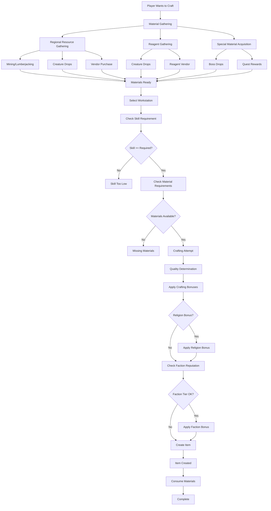

# Crafting System Flow Architecture

**System:** Vystia Crafting Disciplines  
**Components:** 10 crafting disciplines, vendors, materials, workstations  
**Last Updated:** 2025-01-10

---

## Overview

The crafting system provides 10 unique crafting disciplines, each tied to specific classes. This document describes the complete flow from material gathering through item creation.

---

## Flow Diagram



---

## Detailed Flow Steps

### 1. Material Gathering

**Process:**
1. Player gathers materials through various methods
2. Materials stored in inventory
3. Materials tracked by type and quantity

**Gathering Methods:**

#### Regional Resource Gathering
- **Mining:** Ores (8 regional types)
- **Lumberjacking:** Woods (7+ regional types)
- **Butchery:** Leathers (3+ types)
- **Herbalism:** Herbs and reagents

**Files:**
- `ServUO/Scripts/Items/Vystia/Resources/Ores/VystiaOres.cs`
- `ServUO/Scripts/Items/Vystia/Resources/Woods/VystiaWoods.cs`
- `ServUO/Scripts/Items/Vystia/Resources/Leathers/`

#### Reagent Gathering
- **Creature Drops:** Reagents drop from creatures
- **Vendor Purchase:** Reagent vendors sell all 96 reagents
- **Gathering:** Some reagents can be gathered

**Files:**
- `ServUO/Scripts/Items/Vystia/Resources/Reagents/`
- `ServUO/Scripts/Mobiles/Vystia/Vendors/VystiaReagentVendor.cs`

#### Special Material Acquisition
- **Boss Drops:** Rare materials from regional bosses
- **Quest Rewards:** Materials as quest completion rewards
- **Faction Rewards:** Materials from faction reputation

**Special Materials:**
- Eternal Ice (Frosthold)
- Everburning Coal (Emberlands)
- Heart of Winter (Frost Father boss)
- Lava Pearl (Volcano Wyrm boss)
- ... (10+ special materials)

---

### 2. Crafting Process

**Entry Point:** Player uses workstation or crafting tool

**Process:**
1. Player selects crafting discipline
2. System checks workstation/tool availability
3. Crafting menu displayed
4. Player selects recipe
5. System validates requirements
6. Crafting attempt made
7. Item created

**Files:**
- `ServUO/Scripts/Custom/VystiaClasses/Crafting/Def[Discipline].cs`
- `ServUO/Scripts/Services/Craft/Core/CraftSystem.cs`

**Workstation Requirements:**
- Engineering → Steam Forge
- Transmutation → Alchemist's Lab
- Runecrafting → Runic Altar
- Inscription → Scriptorium
- Leathercraft → Tanning Rack
- Woodshaping → Living Workshop
- Clothcraft → Loom
- Necrocraft → Ossuary
- Jewelcraft → Jeweler's Bench
- Smithing → Regional Forge

---

### 3. Skill Requirement Check

**Process:**
1. Recipe defines minimum skill
2. System checks player's skill level
3. If skill too low → Crafting fails
4. If skill sufficient → Continue

**Skill Calculation:**
- Base skill level
- + Religion bonus (if applicable)
- + Faction bonus (if applicable)
- = Effective skill level

**Example:**
```csharp
// From DefEngineering.cs
double skill = from.Skills[SkillName.Engineering].Value;
if (from.Religion == VystiaReligion.CogsmithCreed)
    skill += 5.0; // Religion bonus
```

---

### 4. Material Requirement Check

**Process:**
1. Recipe defines required materials
2. System checks player inventory
3. If materials missing → Crafting fails
4. If materials sufficient → Continue

**Material Types:**
- Ores/Ingots (8 regional types)
- Woods/Boards (7+ types)
- Leathers (3+ types)
- Reagents (96 types)
- Special materials (10+ types)
- Mechanical components (Gears, Springs, Steam Cores)

---

### 5. Quality Determination

**Process:**
1. Base quality roll (0-100%)
2. Skill level affects quality chance
3. Religion bonuses applied
4. Faction bonuses applied
5. Quality tier determined

**Quality Tiers:**
- Standard (1.0× value)
- Quality (1.4× value) - Skill +10
- Exceptional (1.8× value) - Skill +20, quality materials
- Masterwork (2.5× value) - GM skill, runic tool
- Legendary (5.0× value) - GM skill, boss materials, faction rep

**Files:**
- `ServUO/Scripts/Services/Craft/Core/CraftItem.cs`

---

### 6. Class-Specific Crafting

**Process:**
1. Player has class with crafting ability
2. Access class-specific recipes
3. Use class-specific materials
4. Apply class-religion crafting bonuses

**Examples:**

#### Artificer (Engineering)
- Craft constructs (Clockwork Spider, Repair Drone, etc.)
- Use Steam Core materials
- Steam resource affects crafting

#### Alchemist (Transmutation)
- Craft resource potions (Fury Draught, Chi Elixir, etc.)
- Use reagent materials
- Reagent Stock resource affects crafting

#### Enchanter (Runecrafting)
- Craft enchantments and runes
- Use runic materials
- Runic Power resource affects crafting

---

### 7. Vendor Integration

**Process:**
1. Player accesses faction vendor
2. System checks faction reputation
3. If reputation sufficient → Access granted
4. Vendor discount applied based on tier
5. Tier-gated recipes available

**Faction Vendor Tiers:**
- Friendly (3,000+ rep): 5% discount, basic recipes
- Honored (6,000+ rep): 8% discount, standard recipes
- Revered (12,000+ rep): 12% discount, advanced recipes
- Exalted (15,000+ rep): 15% discount, legendary recipes

**Files:**
- `ServUO/Scripts/Custom/VystiaClasses/Factions/VystiaFactionVendor.cs`

---

## Crafting Discipline Flows

### Engineering (Artificer)

**Flow:**
1. Gather materials (Gears, Springs, Steam Core)
2. Access Steam Forge
3. Select construct recipe
4. Check Engineering skill
5. Check Steam resource (if needed)
6. Craft construct
7. Construct item created

**Special Mechanics:**
- Steam resource affects crafting success
- Constructs require Steam Cores
- Constructs can be summoned/controlled

### Transmutation (Alchemist)

**Flow:**
1. Gather reagents
2. Access Alchemist's Lab
3. Select potion recipe
4. Check Alchemy Mastery skill
5. Check Reagent Stock
6. Craft potion
7. Potion created with effect

**Special Mechanics:**
- Resource potions modify secondary resources
- Potion effectiveness affected by skill
- Religion bonus (Lunara's Covenant) increases effectiveness

### Runecrafting (Enchanter)

**Flow:**
1. Gather runic materials
2. Access Runic Altar
3. Select enchantment recipe
4. Check Runeweaving skill
5. Check Runic Power resource
6. Craft enchantment
7. Enchanted item created

**Special Mechanics:**
- Runic Power affects crafting
- Enchantments can be permanent
- Religion bonus (Celestis Arcanum) increases success

---

## Integration Points

### Crafting → Religion Integration

**Flow:**
1. Player has religion
2. Religion crafting bonuses checked
3. Bonuses applied to skill/quality
4. Blessed item crafting available (Zealot tier)

**Religion Bonuses:**
- Cogsmith Creed: +3-5 Crafting skill, +10% exceptional chance
- Lunara's Covenant: +10% potion effectiveness
- Celestis Arcanum: +5% enchant success

### Crafting → Faction Integration

**Flow:**
1. Player has faction reputation
2. Faction vendor accessed
3. Tier-gated recipes available
4. Vendor discount applied

**Faction Benefits:**
- Recipe access by tier
- Vendor discounts
- Special materials from faction vendors

---

## Code References

### Key Files

1. **Crafting Systems:**
   - `ServUO/Scripts/Custom/VystiaClasses/Crafting/DefEngineering.cs`
   - `ServUO/Scripts/Custom/VystiaClasses/Crafting/DefTransmutation.cs`
   - `ServUO/Scripts/Custom/VystiaClasses/Crafting/DefRunecrafting.cs`
   - ... (10 total discipline files)

2. **Crafting Recipes:**
   - `ServUO/Scripts/Custom/VystiaClasses/Crafting/VystiaCraftingRecipes.cs`

3. **Materials:**
   - `ServUO/Scripts/Items/Vystia/Resources/`

4. **Vendors:**
   - `ServUO/Scripts/Mobiles/Vystia/Vendors/`
   - `ServUO/Scripts/Custom/VystiaClasses/Factions/VystiaFactionVendor.cs`

---

## Testing Scenarios

### Test 1: Basic Crafting
1. Create Artificer character
2. Gather materials (Gears, Springs)
3. Access Steam Forge
4. Select recipe
5. Verify skill check
6. Verify material check
7. Craft item
8. Verify item created

### Test 2: Religion Bonus
1. Create Alchemist character
2. Join Lunara's Covenant religion
3. Reach Adherent tier (50 piety)
4. Craft potion
5. Verify effectiveness bonus applied

### Test 3: Faction Vendor
1. Gain faction reputation
2. Access faction vendor
3. Verify discount applied
4. Verify tier-gated recipes available

---

**Document Status:** Complete  
**Last Updated:** 2025-01-10

