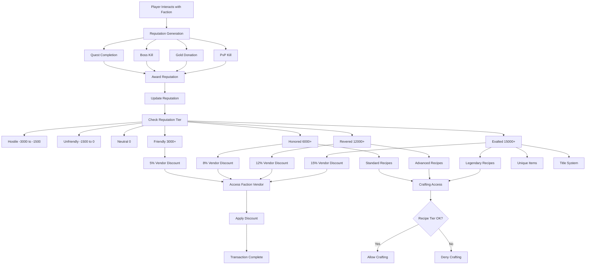

# Faction System Flow Architecture

**System:** Vystia Faction System  
**Components:** 7 factions, reputation tracking, vendor discounts, tier-gated access  
**Last Updated:** 2025-01-10

---

## Overview

The faction system provides reputation-based benefits including vendor discounts, recipe access, and PvP rewards. This document describes the complete flow from faction reputation through all faction mechanics.

---

## Flow Diagram



---

## Detailed Flow Steps

### 1. Faction Reputation

**Reputation Range:** -3,000 to 21,000

**Reputation Tiers:**

| Tier | Reputation Range | Vendor Discount | Benefits |
|------|------------------|----------------|----------|
| Hostile | -3,000 to -1,500 | +25% prices | Attacked on sight |
| Unfriendly | -1,500 to 0 | +10% prices | Suspicion |
| Neutral | 0 | None | Default state |
| Friendly | 3,000+ | 5% discount | Basic faction quests |
| Honored | 6,000+ | 8% discount | Standard recipes |
| Revered | 12,000+ | 12% discount | Advanced recipes |
| Exalted | 15,000+ | 15% discount | Legendary recipes, unique items, title |

**Files:**
- `ServUO/Scripts/Custom/VystiaClasses/Factions/VystiaReputation.cs`
- `ServUO/Scripts/Custom/VystiaClasses/Factions/VystiaFactionSystem.cs`

**Factions:**
1. Ironclad Alliance
2. Sylvan Concord
3. League of Sands
4. Polar Alliance
5. Maritime Sovereignty
6. Highland Compact
7. Arcane Coalition

---

### 2. Reputation Generation

**Methods:**

#### Quest Completion
- **Action:** Complete faction-aligned quest
- **Reward:** +50 to +500 reputation (based on tier)
- **Files:** `VystiaQuestSystem.cs` (lines 227-236)

#### Boss Kills
- **Action:** Kill faction-aligned boss
- **Reward:** +100 reputation
- **Status:** ⚠️ Framework exists, needs integration

#### Gold Donation
- **Action:** Donate gold to faction
- **Reward:** +50 reputation per 1,000g
- **Daily Cap:** 500 reputation (10,000g)
- **Status:** ⚠️ Framework exists, needs donation NPC/UI

#### PvP Kills
- **Action:** Kill enemy faction member (PvP)
- **Reward:** +25 reputation
- **Status:** ⚠️ Framework exists, needs PvP kill handler

**Reputation Rewards:**
```csharp
// From VystiaFactionSystem.cs
public const int SmallQuestReward = 50;
public const int MediumQuestReward = 150;
public const int LargeQuestReward = 350;
public const int EpicQuestReward = 500;
public const int RegionalBossReward = 100;
public const int EnemyKillReward = 25;
```

**Files:**
- `ServUO/Scripts/Custom/VystiaClasses/Factions/VystiaFactionSystem.cs`
- `ServUO/Scripts/Custom/VystiaClasses/Factions/ReputationRewards.cs`

---

### 3. Vendor Discounts

**Process:**
1. Player accesses faction vendor
2. System checks faction reputation
3. Discount percentage determined by tier
4. Discount applied to buy/sell prices

**Discount Tiers:**
- Friendly (3,000+): 5% discount
- Honored (6,000+): 8% discount
- Revered (12,000+): 12% discount
- Exalted (15,000+): 15% discount

**Files:**
- `ServUO/Scripts/Custom/VystiaClasses/Factions/VystiaFactionVendor.cs`

**Discount Application:**
```csharp
// From VystiaFactionVendor.cs
double discount = GetDiscountForTier(reputationTier);
int finalPrice = (int)(basePrice * (1.0 - discount));
```

---

### 4. Recipe Access (Tier-Gated)

**Process:**
1. Player accesses crafting system
2. System checks faction reputation
3. Recipe availability determined by tier
4. Recipes filtered by tier access

**Recipe Tiers:**
- Friendly: Basic recipes
- Honored: Standard recipes
- Revered: Advanced recipes
- Exalted: Legendary recipes

**Status:** ⚠️ Framework exists, recipes need tier assignment

**Files:**
- `ServUO/Scripts/Custom/VystiaClasses/Crafting/`

---

### 5. Unique Items (Exalted Tier)

**Process:**
1. Player reaches Exalted tier (15,000+ reputation)
2. Unique item vendors available
3. Player can purchase faction-specific unique items

**Status:** ⚠️ Framework exists, unique items need implementation

**Files:**
- `ServUO/Scripts/Custom/VystiaClasses/Factions/VystiaFactionVendor.cs`

---

### 6. Title System (Exalted Tier)

**Process:**
1. Player reaches Exalted tier
2. Title awarded based on faction
3. Title displayed in player name/title

**Status:** ❌ Not implemented

**Files:**
- Needs implementation

---

## Integration Points

### Faction → Quest Integration

**Flow:**
1. Quest has faction alignment
2. Quest completion awards reputation
3. Reputation amount based on quest tier

**Code Evidence:**
```csharp
// From VystiaQuestSystem.cs lines 227-236
if (quest.Faction != VystiaFaction.None && quest.ReputationTier > 0)
{
    ReputationRewards.AwardQuestReputation(pm, quest.Faction, quest.ReputationTier);
}
```

**Files:**
- `ServUO/Scripts/Custom/VystiaClasses/Quests/VystiaQuestSystem.cs`
- `ServUO/Scripts/Custom/VystiaClasses/Factions/VystiaFactionSystem.cs`

### Faction → Vendor Integration

**Flow:**
1. Player accesses faction vendor
2. Faction reputation checked
3. Discount applied
4. Tier-gated stock available

**Files:**
- `ServUO/Scripts/Custom/VystiaClasses/Factions/VystiaFactionVendor.cs`

### Faction → Crafting Integration

**Flow:**
1. Player accesses crafting system
2. Faction reputation checked
3. Tier-gated recipes available
4. Faction-specific materials available

**Files:**
- `ServUO/Scripts/Custom/VystiaClasses/Crafting/`

### Faction → PvP Integration

**Flow:**
1. Player kills enemy faction member
2. Reputation awarded
3. PvP rewards framework exists

**Status:** ⚠️ Framework exists, needs PvP kill handler

**Files:**
- `ServUO/Scripts/Custom/VystiaClasses/Factions/VystiaFactionSystem.cs`

---

## Design Mismatches

### Tier Names

**Design Document:**
- Friendly (1-1,500)
- Allied (1,501-4,500)
- Honored (4,501-9,000)
- Revered (9,001-15,000)
- Exalted (15,000+)

**Implementation:**
- Friendly (3,000+)
- Honored (6,000+)
- Revered (12,000+)
- Exalted (15,000+)

**Issue:** "Allied" tier missing, thresholds differ

**Recommendation:** Align thresholds with design or update design document

---

## Code References

### Key Files

1. **Faction Core:**
   - `ServUO/Scripts/Custom/VystiaClasses/Factions/VystiaFactionSystem.cs`
   - `ServUO/Scripts/Custom/VystiaClasses/Factions/VystiaReputation.cs`

2. **Reputation Rewards:**
   - `ServUO/Scripts/Custom/VystiaClasses/Factions/VystiaFactionSystem.cs` (ReputationRewards class)

3. **Faction Vendors:**
   - `ServUO/Scripts/Custom/VystiaClasses/Factions/VystiaFactionVendor.cs`

---

## Testing Scenarios

### Test 1: Reputation Generation
1. Player completes faction-aligned quest
2. Verify reputation awarded
3. Verify reputation amount correct for tier
4. Verify tier progression

### Test 2: Vendor Discount
1. Player gains faction reputation
2. Player accesses faction vendor
3. Verify discount applied
4. Verify discount percentage correct for tier

### Test 3: Recipe Access
1. Player gains faction reputation
2. Player accesses crafting system
3. Verify tier-gated recipes available
4. Verify recipes match tier

---

**Document Status:** Complete  
**Last Updated:** 2025-01-10
