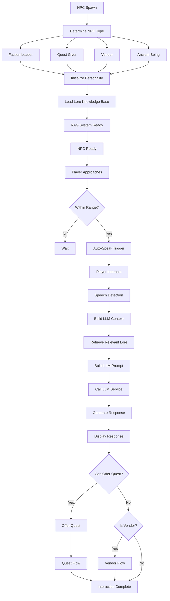

# NPC System Flow Architecture

**System:** LLM-Enabled NPCs  
**Components:** LLM integration, lore system, personality system, quest offering  
**Last Updated:** 2025-01-10

---

## Overview

The NPC system provides LLM-powered conversational NPCs with context awareness, lore integration, and dynamic quest offering. This document describes the complete flow from NPC spawning through interaction and dialogue.

---

## Flow Diagram



---

## Detailed Flow Steps

### 1. NPC Spawning

**Process:**
1. NPC type determined (faction leader, quest giver, vendor, ancient being)
2. NPC class instantiated
3. NPC properties set:
   - Name
   - Title
   - Personality type
   - Speech pattern
   - Hearing range
4. NPC spawned at location

**Files:**
- `ServUO/Scripts/Services/LLM/Core/LLMNpc.cs`
- `ServUO/Scripts/Custom/VystiaClasses/Quests/QuestNPC.cs`
- `ServUO/Scripts/Mobiles/Vystia/NPCs/`

**NPC Types:**
- **Faction Leaders:** 5 faction leaders
- **Quest Givers:** 2+ quest givers
- **Vendors:** 3+ essential vendors
- **Ancient Beings:** 12 ancient beings
- **Talking Creatures:** 12 talking creatures

---

### 2. Personality Initialization

**Process:**
1. Personality type assigned (Wise, Gruff, Mysterious, Friendly, etc.)
2. Speech pattern assigned (Formal, Archaic, Common, etc.)
3. Personality prompt generated
4. NPC appearance initialized based on personality

**Personality Types:**
- Wise, Gruff, Mysterious, Friendly, Hostile
- Noble, Scholarly, Military, Religious
- Custom per NPC

**Files:**
- `ServUO/Scripts/Services/LLM/Data/NPCPersonalities.cs`

---

### 3. Lore Knowledge Base Loading

**Process:**
1. Lore entries loaded from JSON files
2. RAG (Retrieval-Augmented Generation) system initialized
3. Knowledge base formatted for LLM
4. NPC ready for conversation

**Lore System:**
- 195 lore entries across 16 JSON domain files
- Keyword-based search (SimpleLoreSystem)
- RAG system for context retrieval

**Files:**
- `ServUO/Scripts/Services/LLM/Data/SimpleLoreSystem.cs`
- `ServUO/Data/Lore/` (16 JSON files)

---

### 4. Player Interaction

**Process:**
1. Player approaches NPC (within hearing range)
2. Proximity auto-speak triggered (optional)
3. Player speaks to NPC
4. Speech detected and processed

**Auto-Speak:**
- NPCs can auto-speak when player approaches
- Configurable per NPC
- Personality-based greetings

**Files:**
- `ServUO/Scripts/Custom/VystiaClasses/Quests/QuestNPC.cs` (OnThink method)

---

### 5. LLM Context Building

**Process:**
1. Player speech captured
2. Context built:
   - NPC personality
   - Quest context (if quest NPC)
   - Player information
   - Relevant lore entries
3. LLM prompt constructed
4. LLM service called

**Context Components:**
```csharp
{
    "npcPersonality": "Wise Sage",
    "speechPattern": "Formal",
    "questContext": "Player has active quest X",
    "playerClass": "Barbarian",
    "playerReligion": "Frosthelm Faith",
    "relevantLore": ["Frosthold region", "Barbarian class", ...]
}
```

**Files:**
- `ServUO/Scripts/Services/LLM/LLMConversationHelper.cs`
- `ServUO/Scripts/Services/LLM/Core/LLMNpc.cs`

---

### 6. Lore Retrieval (RAG System)

**Process:**
1. Player speech analyzed for keywords
2. Relevant lore entries retrieved
3. Lore entries formatted for LLM context
4. Context enhanced with lore information

**Lore Retrieval:**
- Keyword matching
- Semantic search (if vector system enabled)
- Domain-specific retrieval

**Files:**
- `ServUO/Scripts/Services/LLM/Data/SimpleLoreSystem.cs`
- `ServUO/Scripts/Services/LLM/Data/VectorLoreSystem.cs`

---

### 7. Response Generation

**Process:**
1. LLM prompt sent to LLM service
2. LLM generates response
3. Response processed and formatted
4. Response displayed to player

**Response Features:**
- Personality-appropriate tone
- Context-aware content
- Lore-integrated information
- Quest-aware dialogue

**Files:**
- `ServUO/Scripts/Services/LLM/Services/LLMService.cs`
- `ServUO/Scripts/Services/LLM/Services/UnifiedLLMService.cs`

---

### 8. Quest Offering

**Process:**
1. NPC checks if can offer quest
2. Quest availability checked
3. Quest offered to player
4. Player accepts/declines
5. Quest flow initiated

**Quest NPC Features:**
- Quest context awareness
- Auto-complete waypoints on interaction
- LLM dialogue about quest
- Quest progress tracking

**Files:**
- `ServUO/Scripts/Custom/VystiaClasses/Quests/QuestNPC.cs`
- `ServUO/Scripts/Services/LLM/Core/LLMQuester.cs`

---

### 9. Vendor Services

**Process:**
1. NPC checks if is vendor
2. Vendor menu displayed
3. Player browses/purchases
4. Faction discount applied (if faction vendor)
5. Transaction complete

**Vendor Types:**
- Magic school vendors (12)
- Reagent vendors (2)
- Resource vendors (1)
- Faction vendors (7+)
- Class item vendors (1)

**Files:**
- `ServUO/Scripts/Mobiles/Vystia/Vendors/`
- `ServUO/Scripts/Custom/VystiaClasses/Factions/VystiaFactionVendor.cs`

---

## NPC Type-Specific Flows

### Faction Leader NPCs

**Flow:**
1. Faction leader spawned
2. Faction alignment set
3. LLM dialogue includes faction context
4. Can offer faction-specific quests
5. Faction reputation interactions

**Files:**
- `ServUO/Scripts/Mobiles/Vystia/NPCs/FactionLeaders/`

### Quest Giver NPCs

**Flow:**
1. Quest giver spawned
2. Linked to quest system
3. LLM dialogue quest-aware
4. Can offer multiple quests
5. Quest progress tracking

**Files:**
- `ServUO/Scripts/Mobiles/Vystia/NPCs/QuestGivers/`
- `ServUO/Scripts/Custom/VystiaClasses/Quests/QuestNPC.cs`

### Ancient Being NPCs

**Flow:**
1. Ancient being spawned
2. Role determined (Quest giver, Recipe teacher, Divine blessing)
3. LLM dialogue includes ancient being context
4. Special functions available:
   - Quest offering
   - Recipe teaching
   - Divine blessing granting

**Files:**
- `ServUO/Scripts/Mobiles/Vystia/Ancients/BaseAncientBeing.cs`
- `ServUO/Scripts/Mobiles/Vystia/NPCs/TalkingCreatures/`

---

## Integration Points

### NPC → Quest Integration

**Flow:**
1. NPC is quest giver
2. Quest context built into LLM prompt
3. Quest-aware dialogue generated
4. Quest offered to player
5. Quest progress tracked

**Files:**
- `ServUO/Scripts/Custom/VystiaClasses/Quests/QuestNPC.cs`

### NPC → Lore Integration

**Flow:**
1. Player asks about topic
2. Relevant lore retrieved
3. Lore integrated into response
4. Context-aware information provided

**Files:**
- `ServUO/Scripts/Services/LLM/Data/SimpleLoreSystem.cs`

### NPC → Faction Integration

**Flow:**
1. NPC is faction-aligned
2. Faction context in dialogue
3. Faction-specific services
4. Faction reputation interactions

**Files:**
- `ServUO/Scripts/Mobiles/Vystia/NPCs/FactionLeaders/`

---

## Code References

### Key Files

1. **LLM NPC Core:**
   - `ServUO/Scripts/Services/LLM/Core/LLMNpc.cs`
   - `ServUO/Scripts/Services/LLM/LLMConversationHelper.cs`

2. **Quest NPCs:**
   - `ServUO/Scripts/Custom/VystiaClasses/Quests/QuestNPC.cs`
   - `ServUO/Scripts/Services/LLM/Core/LLMQuester.cs`

3. **Lore System:**
   - `ServUO/Scripts/Services/LLM/Data/SimpleLoreSystem.cs`
   - `ServUO/Data/Lore/` (16 JSON files)

4. **Personality System:**
   - `ServUO/Scripts/Services/LLM/Data/NPCPersonalities.cs`

---

## Testing Scenarios

### Test 1: Basic NPC Interaction
1. Spawn LLM NPC
2. Player approaches
3. Player speaks to NPC
4. Verify LLM response generated
5. Verify response is context-appropriate

### Test 2: Quest NPC Interaction
1. Spawn quest NPC
2. Link to quest
3. Player interacts
4. Verify quest-aware dialogue
5. Verify quest offering works

### Test 3: Lore Integration
1. Player asks about region
2. Verify relevant lore retrieved
3. Verify lore integrated into response
4. Verify information is accurate

---

**Document Status:** Complete  
**Last Updated:** 2025-01-10
