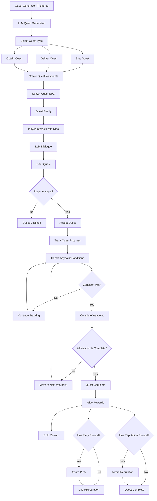

# Quest System Flow Architecture

**System:** Vystia Dynamic Quest System  
**Components:** LLM-powered quest generation, waypoints, NPCs, rewards  
**Last Updated:** 2025-01-10

---

## Overview

The quest system provides dynamic, LLM-powered quest generation with full integration with religion and faction systems. This document describes the complete flow from quest generation through completion and rewards.

---

## Flow Diagram



---

## Detailed Flow Steps

### 1. Quest Generation

**Trigger:** GM command or automatic generation

**Process:**
1. LLM service called with quest context
2. Quest type selected (Slay, Deliver, Obtain)
3. Quest parameters generated:
   - Title
   - Description
   - Objectives
   - Rewards (gold, piety, reputation)
   - Faction/Religion alignment
4. Quest waypoints created
5. Quest NPC spawned (if needed)

**Files:**
- `ServUO/Scripts/Custom/VystiaClasses/Quests/Generation/LLMQuestGenerationService.cs`
- `ServUO/Scripts/Custom/VystiaClasses/Quests/Generation/QuestPlanCompilerAndSpawner.cs`

**Quest Types:**
- **Slay:** Kill X creatures
- **Deliver:** Deliver item to NPC
- **Obtain:** Collect X items

---

### 2. Quest Waypoint Creation

**Process:**
1. Waypoints defined based on quest type
2. Waypoint conditions set:
   - KillCount (for Slay quests)
   - ItemDelivery (for Deliver quests)
   - ItemCollection (for Obtain quests)
   - TalkToNPC (for dialogue quests)
3. Waypoints linked to quest
4. Waypoint detectors created

**Files:**
- `ServUO/Scripts/Custom/VystiaClasses/Quests/QuestWaypoint.cs`
- `ServUO/Scripts/Custom/VystiaClasses/Quests/QuestWaypointDetector.cs`
- `ServUO/Scripts/Custom/VystiaClasses/Quests/QuestKillWaypointDetector.cs`

**Waypoint Structure:**
```csharp
public class QuestWaypoint
{
    public int WaypointID { get; set; }
    public WaypointCondition Condition { get; set; }
    public Dictionary<string, int> Requirements { get; set; }
    public string Description { get; set; }
}
```

---

### 3. Quest NPC Spawning

**Process:**
1. Quest NPC created
2. NPC linked to quest and waypoint
3. NPC personality assigned
4. LLM conversation enabled
5. NPC spawned at location

**Files:**
- `ServUO/Scripts/Custom/VystiaClasses/Quests/QuestNPC.cs`
- `ServUO/Scripts/Services/LLM/Core/LLMQuester.cs`

**NPC Features:**
- LLM-powered dialogue
- Quest context awareness
- Auto-complete waypoints on interaction
- Personality and speech patterns

---

### 4. Quest Acceptance

**Process:**
1. Player interacts with quest NPC
2. LLM generates dialogue
3. Quest offered to player
4. Player accepts quest
5. Quest tracker created for player
6. Quest progress initialized

**Files:**
- `ServUO/Scripts/Custom/VystiaClasses/Quests/VystiaQuestSystem.cs`
- `ServUO/Scripts/Custom/VystiaClasses/Quests/VystiaQuestTracker.cs`

**Quest Tracker:**
```csharp
public class VystiaQuestTracker
{
    private Dictionary<int, QuestProgress> m_ActiveQuests;
    // Tracks progress for each active quest
}
```

---

### 5. Quest Progress Tracking

**Process:**
1. Player performs actions
2. Waypoint detectors monitor actions
3. Progress updated when conditions met
4. Waypoint completion checked
5. Quest completion checked

**Tracking Methods:**
- **Kill Tracking:** QuestKillWaypointDetector monitors creature deaths
- **Item Tracking:** Quest system monitors inventory changes
- **NPC Interaction:** QuestNPC handles talk conditions

**Files:**
- `ServUO/Scripts/Custom/VystiaClasses/Quests/QuestKillWaypointDetector.cs`
- `ServUO/Scripts/Custom/VystiaClasses/Quests/VystiaQuestSystem.cs`

---

### 6. Quest Completion

**Process:**
1. All waypoints completed
2. Quest completion triggered
3. Rewards calculated
4. Rewards given to player
5. Quest marked as complete

**Files:**
- `ServUO/Scripts/Custom/VystiaClasses/Quests/VystiaQuestSystem.cs`

**Completion Check:**
```csharp
public static bool CompleteQuest(PlayerMobile pm, int questID)
{
    // Check objectives
    if (!quest.AreObjectivesComplete(progress))
        return false;
    
    // Give rewards
    quest.GiveRewards(pm);
    
    // Award piety
    if (quest.PietyReward > 0)
        VystiaPiety.AddPiety(pm, quest.PietyReward, $"quest: {quest.Title}");
    
    // Award reputation
    if (quest.Faction != VystiaFaction.None && quest.ReputationTier > 0)
        ReputationRewards.AwardQuestReputation(pm, quest.Faction, quest.ReputationTier);
}
```

---

### 7. Quest Rewards

**Reward Types:**
1. **Gold Rewards:** Based on quest tier
2. **Piety Rewards:** Religion-aligned quests
3. **Reputation Rewards:** Faction-aligned quests
4. **Material Rewards:** Crafting materials

**Quest Tiers:**
- **Initiation (Tier 1):** 100-500g, Level 1-30
- **Apprentice (Tier 2):** 500-2,000g, Level 30-60
- **Journeyman (Tier 3):** 2,000-5,000g, Level 60-90
- **Master (Tier 4):** 5,000-15,000g, Level 90+

**Files:**
- `ServUO/Scripts/Custom/VystiaClasses/Quests/VystiaQuestTiers.cs`
- `ServUO/Scripts/Custom/VystiaClasses/Quests/VystiaQuestSystem.cs`

---

## LLM Integration

### LLM Quest Generation

**Process:**
1. Quest context built (region, faction, religion, class)
2. LLM service called with context
3. Quest plan generated
4. Quest plan validated
5. Quest instance created
6. Quest spawned

**Files:**
- `ServUO/Scripts/Custom/VystiaClasses/Quests/Generation/LLMQuestGenerationService.cs`
- `ServUO/Scripts/Custom/VystiaClasses/Quests/Generation/QuestPlanValidator.cs`

**Quest Context:**
```csharp
{
    "region": "Frosthold",
    "faction": "Polar Alliance",
    "religion": "Frosthelm Faith",
    "class": "Barbarian",
    "questType": "Slay",
    "difficulty": "Medium"
}
```

### LLM NPC Dialogue

**Process:**
1. Player speaks to quest NPC
2. LLM context built (quest, player progress, lore)
3. LLM generates response
4. Response displayed to player
5. Quest waypoint auto-completed (if TalkToNPC condition)

**Files:**
- `ServUO/Scripts/Custom/VystiaClasses/Quests/QuestNPC.cs`
- `ServUO/Scripts/Services/LLM/LLMConversationHelper.cs`

---

## Integration Points

### Quest → Religion Integration

**Flow:**
1. Quest has religion alignment
2. Quest completion awards piety
3. Piety amount based on quest tier
4. Religion-specific quests available

**Piety Rewards:**
- Tier 1: +25 piety
- Tier 2: +50 piety
- Tier 3: +75 piety
- Tier 4: +100 piety

**Files:**
- `ServUO/Scripts/Custom/VystiaClasses/Quests/VystiaQuestSystem.cs` (lines 221-225)

### Quest → Faction Integration

**Flow:**
1. Quest has faction alignment
2. Quest completion awards reputation
3. Reputation amount based on quest tier
4. Faction-specific quests available

**Reputation Rewards:**
- Tier 1: +50 reputation
- Tier 2: +150 reputation
- Tier 3: +350 reputation
- Tier 4: +500 reputation

**Files:**
- `ServUO/Scripts/Custom/VystiaClasses/Quests/VystiaQuestSystem.cs` (lines 227-236)
- `ServUO/Scripts/Custom/VystiaClasses/Factions/VystiaFactionSystem.cs`

---

## Code References

### Key Files

1. **Quest System:**
   - `ServUO/Scripts/Custom/VystiaClasses/Quests/VystiaQuestSystem.cs`
   - `ServUO/Scripts/Custom/VystiaClasses/Quests/VystiaQuestTracker.cs`

2. **Quest Generation:**
   - `ServUO/Scripts/Custom/VystiaClasses/Quests/Generation/LLMQuestGenerationService.cs`
   - `ServUO/Scripts/Custom/VystiaClasses/Quests/Generation/QuestPlanCompilerAndSpawner.cs`

3. **Quest NPCs:**
   - `ServUO/Scripts/Custom/VystiaClasses/Quests/QuestNPC.cs`
   - `ServUO/Scripts/Services/LLM/Core/LLMQuester.cs`

4. **Quest Waypoints:**
   - `ServUO/Scripts/Custom/VystiaClasses/Quests/QuestWaypoint.cs`
   - `ServUO/Scripts/Custom/VystiaClasses/Quests/QuestWaypointDetector.cs`

---

## Testing Scenarios

### Test 1: Basic Quest Flow
1. Generate quest via LLM
2. Spawn quest NPC
3. Player interacts with NPC
4. Player accepts quest
5. Player completes objectives
6. Quest completes
7. Verify rewards given

### Test 2: Religion Quest Integration
1. Generate religion-aligned quest
2. Player completes quest
3. Verify piety reward given
4. Verify piety amount correct

### Test 3: Faction Quest Integration
1. Generate faction-aligned quest
2. Player completes quest
3. Verify reputation reward given
4. Verify reputation amount correct

---

**Document Status:** Complete  
**Last Updated:** 2025-01-10
