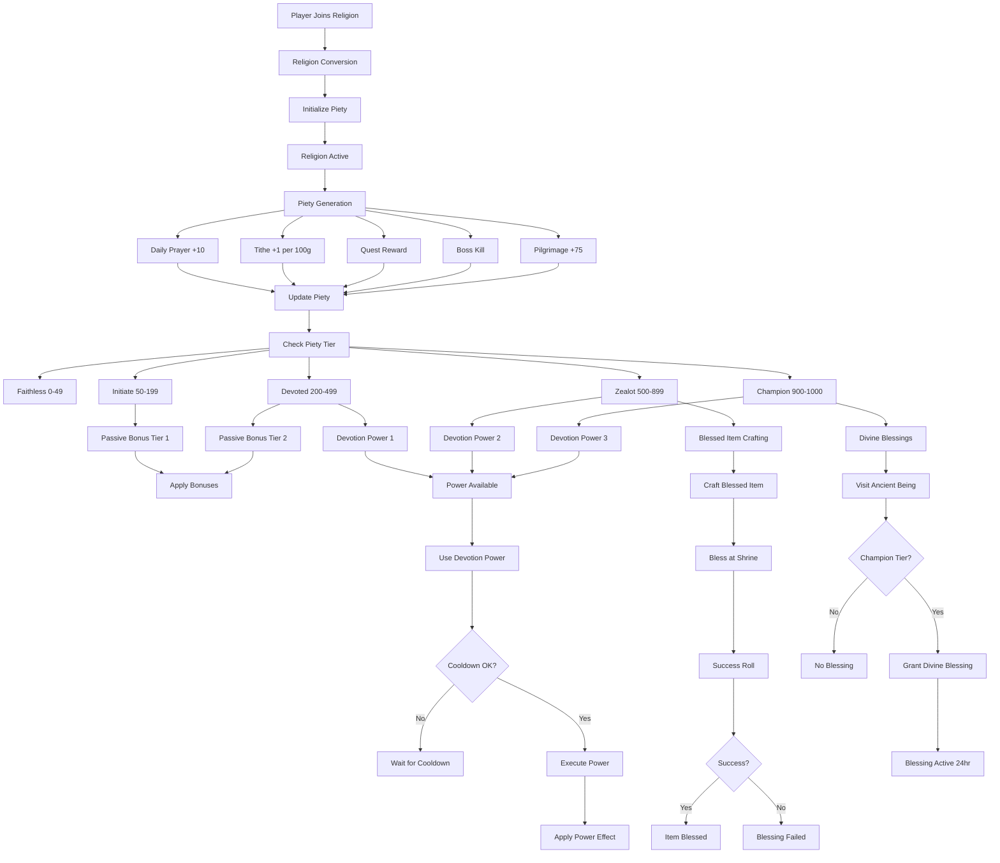

# Religion System Flow Architecture

**System:** Vystia Religion System  
**Components:** 6 religions, piety system, devotion powers, blessed items, shrines  
**Last Updated:** 2025-01-10

---

## Overview

The religion system provides meaningful but not mandatory religious gameplay through piety tracking, passive bonuses, devotion powers, and blessed items. This document describes the complete flow from religion selection through all religion mechanics.

---

## Flow Diagram

---

## Detailed Flow Steps

### 1. Religion Selection

**Process:**
1. Player converts to religion (via GM command or NPC)
2. Religion type assigned
3. Piety initialized (0 or retained from previous religion)
4. Religion change penalties applied (if applicable)

**Religion Change:**
- First change: 50% piety retained, cap at 200
- Second change: 25% piety retained, cap at 100
- Third+ change: 0% piety retained, full reset

**Files:**
- `ServUO/Scripts/Custom/VystiaClasses/Religion/VystiaReligionSystem.cs`
- `ServUO/Scripts/Custom/VystiaClasses/Religion/VystiaPiety.cs`

**Religions:**
1. Frosthelm Faith (Frosthold)
2. Cogsmith Creed (Ironclad)
3. Lunara's Covenant (Verdantpeak)
4. Surya's Sandscript (Desert)
5. Oceana's Covenant (Underwater)
6. Celestis Arcanum (Crystal Barrens)

---

### 2. Piety Generation

**Methods:**

#### Daily Prayer
- **Action:** Pray at shrine
- **Reward:** +10 piety
- **Cooldown:** 20 hours
- **Files:** `VystiaShrine.cs`

#### Tithe System
- **Action:** Donate gold at shrine
- **Reward:** +1 piety per 100g
- **Daily Cap:** 30 piety (3,000g)
- **Files:** `VystiaShrine.cs`

#### Quest Rewards
- **Action:** Complete religion-aligned quest
- **Reward:** +25 to +100 piety (based on tier)
- **Files:** `VystiaQuestSystem.cs`

#### Boss Kills
- **Action:** Kill religion's enemy boss
- **Reward:** +35 piety
- **Files:** Boss death handlers (needs integration)

#### Pilgrimage
- **Action:** Visit shrine (pilgrimage)
- **Reward:** +75 piety
- **Cooldown:** Weekly
- **Status:** ⚠️ Not fully implemented

**Files:**
- `ServUO/Scripts/Custom/VystiaClasses/Religion/VystiaPiety.cs`
- `ServUO/Scripts/Items/Vystia/Religious/VystiaShrine.cs`

---

### 3. Piety Tiers & Benefits

**Tier Progression:**

#### Faithless (0-49 Piety)
- No benefits
- Can pray at shrine
- Can tithe

#### Initiate (50-199 Piety)
- **Passive Bonus Tier 1:** First passive bonus
- Shrine access
- Prayer and tithe available

#### Devoted (200-499 Piety)
- **Passive Bonus Tier 2:** Second passive bonus
- **Devotion Power 1:** First active power
- Power recharge at shrine

#### Zealot (500-899 Piety)
- **Devotion Power 2:** Second active power
- **Blessed Item Crafting:** Can bless items at shrine

#### Champion (900-1000 Piety)
- **Devotion Power 3:** Third active power
- **Divine Blessings:** Can receive blessings from ancient beings
- Free resurrection at shrine

**Files:**
- `ServUO/Scripts/Custom/VystiaClasses/Religion/VystiaPiety.cs`
- `ServUO/Scripts/Custom/VystiaClasses/Religion/VystiaDevotionPowers.cs`

---

### 4. Passive Bonuses

**Tier 1 Bonuses (Initiate - 50 Piety):**

| Religion | Bonus |
|----------|-------|
| Frosthelm Faith | +5% Cold Resistance |
| Cogsmith Creed | +5% Fire Resistance |
| Lunara's Covenant | +5% Poison Resistance |
| Surya's Sandscript | +5% Fire Resistance |
| Oceana's Covenant | Water Breathing |
| Celestis Arcanum | +5% Energy Resistance |

**Tier 2 Bonuses (Devoted - 200 Piety):**
- Stacks with Tier 1
- Additional bonuses per religion

**Files:**
- `ServUO/Scripts/Custom/VystiaClasses/Religion/VystiaReligionSystem.cs`

---

### 5. Devotion Powers

**Power System:**
- 3 powers per religion (18 total)
- Cooldown-based activation
- Power recharge at shrine (Devoted tier)

**Power 1 (200 Piety) - Utility:**
- Forge Blessing: +10% exceptional craft chance
- Moonlight Healing: Heal 30-50 HP in 5 tiles
- Sun's Revelation: Reveal hidden 8 tiles
- ... (6 total)

**Power 2 (500 Piety) - Combat:**
- Steam Burst: AoE 30-50 fire damage
- Nature's Sanctuary: Zone +25% healing
- Time Dilation: +25% attack/cast speed
- ... (6 total)

**Power 3 (900 Piety) - Ultimate:**
- Machinist's Grace: Repair all gear, +15% damage
- Lunara's Embrace: Full heal + cleanse + immunity
- Solar Judgment: Cone 75-100 fire damage
- ... (6 total)

**Known TODOs:**
- ⚠️ Endurance of Winter: "Cannot die" flag
- ⚠️ Nature's Sanctuary: Zone-based healing bonus
- ⚠️ Celestial Alignment: Spell count tracking
- ⚠️ Abyssal Call: Water elemental summon

**Files:**
- `ServUO/Scripts/Custom/VystiaClasses/Religion/VystiaDevotionPowers.cs`

---

### 6. Blessed Item Crafting

**Process:**
1. Player brings craftable item to shrine
2. Player pays tithe (5% of item base value)
3. Piety check determines success
4. Item gains religion-specific blessing

**Success Rates:**
- 500-599 piety: 50% success, 3% critical
- 600-699 piety: 60% success, 5% critical
- 700-799 piety: 70% success, 8% critical
- 800-899 piety: 80% success, 12% critical
- 900-1000 piety: 90% success, 18% critical

**Blessing Effects:**
- Standard: Religion-specific bonus (+5% damage, +5 HP, etc.)
- Critical: Enhanced bonus (+10% damage, +10 HP, etc.) + special effect

**Usage Restrictions:**
- Same religion: Full effect
- Faithless: 50% effect
- Different (non-opposed): 25% effect
- Opposed religion: Cannot equip

**Files:**
- `ServUO/Scripts/Custom/VystiaClasses/Religion/VystiaBlessedItems.cs`
- `ServUO/Scripts/Items/Vystia/Religious/VystiaShrine.cs`

---

### 7. Divine Blessings (Champion Tier)

**Process:**
1. Player reaches Champion tier (900 piety)
2. Player visits ancient being
3. Ancient being grants divine blessing
4. Blessing active for 24 hours

**Divine Blessings:**
- Machinist's Perfection: +15% exceptional craft (Great Machinist's Construct)
- Lunar Radiance: +15% healing (Lunara's Dryad Herald)
- Solar Clarity: Immune to illusions/blind (Sphynx of Emberlands)
- Abyssal Favor: Water breathing, +35% swim (Abyssus)
- Starlight: +15% spell power (Crystalwing)
- Frost Father's Endurance: +50 HP, immune to slow (Frost Father's Avatar)

**Files:**
- `ServUO/Scripts/Mobiles/Vystia/Ancients/VystiaDivineBlessingSystem.cs`

---

### 8. Religion PvP

**Opposed Religion Bonuses:**
- Initiate: +2% damage vs opposed
- Adherent: +4% damage vs opposed
- Devoted: +6% damage vs opposed
- Zealot: +8% damage vs opposed
- Champion: +10% damage vs opposed, -3% damage taken

**Healing Effectiveness:**
- Same religion: 100% effectiveness
- Neutral religions: 100% effectiveness
- Opposed religions: 50% effectiveness

**Files:**
- `ServUO/Scripts/Custom/VystiaClasses/Religion/VystiaReligionSystem.cs`

---

## Integration Points

### Religion → Class Integration

**Flow:**
1. Player has class and religion
2. Class-religion synergy checked
3. Synergy bonuses applied:
   - Resource bonuses (max, generation, cost reduction)
   - Skill bonuses
   - Damage bonuses
   - Duration bonuses

**Examples:**
- Monk + Cogsmith Creed → -10% Chi ability cost
- Barbarian + Frosthelm Faith → -15% Fury decay
- Druid + Lunara's Covenant → +25% shapeshift duration

**Files:**
- `ServUO/Scripts/Custom/VystiaClasses/Systems/VystiaSkillIntegration.cs`

### Religion → Quest Integration

**Flow:**
1. Quest has religion alignment
2. Quest completion awards piety
3. Piety amount based on quest tier

**Files:**
- `ServUO/Scripts/Custom/VystiaClasses/Quests/VystiaQuestSystem.cs`

### Religion → Faction Integration

**Flow:**
1. Religion aligned with faction
2. Faction-aligned religions provide bonuses
3. Opposed religions provide PvP bonuses

**Files:**
- `ServUO/Scripts/Custom/VystiaClasses/Religion/VystiaReligionSystem.cs`

---

## Code References

### Key Files

1. **Religion Core:**
   - `ServUO/Scripts/Custom/VystiaClasses/Religion/VystiaReligionSystem.cs`
   - `ServUO/Scripts/Custom/VystiaClasses/Religion/VystiaPiety.cs`

2. **Devotion Powers:**
   - `ServUO/Scripts/Custom/VystiaClasses/Religion/VystiaDevotionPowers.cs`

3. **Blessed Items:**
   - `ServUO/Scripts/Custom/VystiaClasses/Religion/VystiaBlessedItems.cs`

4. **Shrines:**
   - `ServUO/Scripts/Items/Vystia/Religious/VystiaShrine.cs`

---

## Testing Scenarios

### Test 1: Piety Generation
1. Player joins religion
2. Player prays at shrine
3. Verify +10 piety
4. Player tithes 1,000g
5. Verify +10 piety (capped at 30/day)

### Test 2: Devotion Power
1. Player reaches Devoted tier (200 piety)
2. Player uses Devotion Power 1
3. Verify power effect applied
4. Verify cooldown triggered
5. Player recharges at shrine
6. Verify cooldown reset

### Test 3: Blessed Item
1. Player reaches Zealot tier (500 piety)
2. Player brings item to shrine
3. Player pays tithe
4. Verify blessing success roll
5. Verify item blessed if successful

---

**Document Status:** Complete  
**Last Updated:** 2025-01-10
